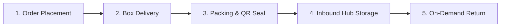
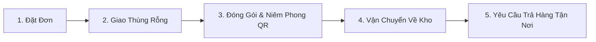

# 📦 Smart Mini Storage (SMS) - Da Nang

<div align="center">

**Smart Storage – Safe Delivery | Lưu trữ thông minh – Vận chuyển an toàn**

[](#-english)
[](#-ti%E1%BA%BFng-vi%E1%BB%87t)

_A smart on-demand mini-storage and doorstep logistics management system for Tourists, E-commerce Sellers, and Urban Households in Da Nang City, Vietnam._

</div>

---

# 🇬🇧 English

## 📑 Table of Contents

- [Project Overview](#-project-overview)
- [Key Features](#-key-features)
- [Tech Stack & Architecture](#-tech-stack--architecture)
- [Project Structure](#-project-structure)
- [Pricing Plans](#-pricing-plans)
- [Getting Started & Installation](#-getting-started--installation)
  - [1. Backend (FastAPI)](#1-backend-fastapi)
  - [2. Web Frontend (React)](#2-web-frontend-react)
  - [3. Mobile App (React Native / Expo)](#3-mobile-app-react-native--expo)
- [5-Step Operational Flow](#-5-step-operational-flow)
- [Team & Contact](#-team--contact)

---

## 🌟 Project Overview

**Smart Mini Storage (SMS)** is an end-to-end cloud-connected storage and doorstep logistics platform designed to solve urban space constraints and travel inconvenience in Da Nang City:

- **✈️ Tourists & Travelers**: Secure temporary luggage storage before check-in or after check-out, with seamless doorstep pick-up & delivery to airports/hotels.
- **🏬 Online Shop Owners & SMEs**: Flexible micro-warehousing scaling with seasonal inventory without long-term commercial leases.
- **🏠 Urban Households**: Clutter-free living spaces by offloading seasonal items (winter clothes, bedding, bulky gears) into high-security climate-controlled hubs.

---

## 🚀 Key Features

### 1. 👤 Customer Experience (Web & Mobile App)

- **Modern Landing Page**: Dynamic animations, transparent pricing, and responsive service exploration.
- **On-Demand Booking**: Choose customized box sizes (S, M, L), describe stored items, and select delivery/pickup time slots.
- **Intelligent Cost Calculator**: Real-time shipping calculation based on distance (km) and stair/floor surcharges.
- **Live Storage Countdown Timer**: Detailed countdown (months, days, hours, minutes, seconds) with overtime alerts.
- **Real-Time Order Tracking**: End-to-end lifecycle tracking (_Pending -> Picking up -> In Hub -> Ready for Return -> Delivering -> Completed_).
- **24/7 AI Storage Consultant**: Integrated AI Chatbot helping users select the optimal box size and answering service FAQs.

### 2. 🚚 Shipper & Field Operations (Mobile App)

- **QR Code Scanning**: Instant check-in/check-out with anti-tamper security seals.
- **Route Navigation & Dispatch**: View optimized pickup/delivery routes and customer contact details.
- **Instant Status Sync**: Real-time push updates to the central warehouse management system.

### 3. 🏢 Warehouse Management System (WMS Admin)

- **Visual Inventory Management**: U-shaped storage layout optimization for maximum space utilization.
- **Order & Customer Lifecycle Control**: Manage extensions, returns, cancellations, and notifications.
- **Role-Based Access Control (RBAC)**: Distinct permissions for Super Admins, Hub Operators, and Drivers.

---

## 🛠️ Tech Stack & Architecture

| Layer               | Technologies                                                                             |
| :------------------ | :--------------------------------------------------------------------------------------- |
| **Backend API**     | Python 3.10+, FastAPI, Uvicorn, Motor (Async MongoDB), Pydantic                          |
| **Database**        | MongoDB Atlas / Local MongoDB                                                            |
| **Security & Auth** | PyJWT (JSON Web Tokens), Bcrypt (Password Hashing)                                       |
| **AI Integration**  | LiteLLM, Groq API (High-speed LLaMA-based AI Assistant)                                  |
| **Web Frontend**    | React 19, React Router v7, TailwindCSS, Radix UI, Framer Motion, Leaflet Maps, Axios     |
| **Mobile App**      | React Native, Expo SDK 54, NativeWind (Tailwind), React Navigation, Expo Camera/Location |

---

## 📁 Project Structure

```text
smart-mini-storage-danang/
├── backend/                  # RESTful API Server (Python / FastAPI)
│   ├── server.py             # Main API endpoints & business logic
│   ├── chatbot.py            # AI Chatbot service integration
│   ├── requirements.txt      # Python dependencies
│   └── ...
├── frontend/                 # Web Application (React.js)
│   ├── public/               # Public assets (logo, icons, index.html)
│   ├── src/
│   │   ├── components/       # Reusable UI components & Dialogs
│   │   ├── context/          # Auth context & Global state
│   │   ├── pages/            # LandingPage, CustomerDashboard, AdminDashboard, ShipperApp...
│   │   └── ...
│   └── package.json
├── mobile/                   # Mobile Application (Expo / React Native)
│   ├── src/
│   │   ├── components/       # Mobile UI components
│   │   ├── navigation/       # Stack & Bottom Tabs navigators
│   │   ├── screens/          # Customer, Shipper & Admin screens
│   │   └── services/         # API & Storage services
│   ├── app.json              # Expo configuration
│   └── package.json
├── image/                    # Branding assets & media
└── README.md                 # Project Documentation
```

---

## 💰 Pricing Plans

|        Box Size        | Dimensions (L x W x H) | Capacity |  Daily Rate   |  Monthly Rate   | Recommended Capacity                                               |
| :--------------------: | :--------------------: | :------: | :-----------: | :-------------: | :----------------------------------------------------------------- |
|       **Size S**       |  52 x 36.5 x 27.5 cm   | ~52.2 L  | **4,000 VND** | **120,000 VND** | 3-5 pairs of shoes, documents, laptop bag / 25-30 shirts           |
| **Size M** _(Popular)_ |   62 x 44.5 x 32 cm    | ~88.4 L  | **6,000 VND** | **180,000 VND** | Camping gear, winter blankets, sports equipment / 50-60 shirts     |
|       **Size L**       |   69.5 x 50 x 36 cm    | ~125.1 L | **9,000 VND** | **270,000 VND** | Large suitcases, mattress/bedding sets, relocation / 80-100 shirts |

---

## ⚙️ Getting Started & Installation

### Prerequisites

- **Node.js** (>= 18.x) & **Yarn** or **npm**
- **Python** (>= 3.10)
- **MongoDB** (Local instance or MongoDB Atlas URI)
- **Expo Go** app on iOS / Android (for mobile testing)

---

### 1. Backend (FastAPI)

```bash
# Navigate to backend directory
cd backend

# Create and activate virtual environment
python -m venv venv
# On Windows:
venv\Scripts\activate
# On macOS/Linux:
source venv/bin/activate

# Install dependencies
pip install -r requirements.txt

# Start API server
uvicorn server:app --reload --port 8000
```

> Swagger API Interactive Docs: `http://localhost:8000/docs`

---

### 2. Web Frontend (React)

```bash
# Navigate to frontend directory
cd frontend

# Install packages
yarn install
# or: npm install

# Start local dev server
yarn start
# or: npm start
```

> Web Application URL: `http://localhost:3000`

---

### 3. Mobile App (React Native / Expo)

```bash
# Navigate to mobile directory
cd mobile

# Install dependencies
npm install

# Start Expo development server
npx expo start -c
```

> Scan the QR code using the **Expo Go** mobile app (Android/iOS).

---

## 🔄 5-Step Operational Flow



1. **Order Placement**: Book box sizes and schedule pickup times via App/Web.
2. **Box Delivery**: Shipper delivers durable sanitized plastic storage boxes to your doorstep.
3. **Packing & QR Seal**: Customer packs personal items and applies security seals with unique QR codes.
4. **Secure Inbound Storage**: Items are securely stored in 24/7 camera-monitored, climate-controlled hubs.
5. **On-Demand Return**: Request doorstep return with a single tap whenever needed.

---

## 👥 Team & Contact

- **Organization**: Smart Mini Storage Team – Da Nang City, Vietnam
- **Tagline**: _Smart Storage – Safe Delivery_
- **Support Inquiries**: DucDC@smartmini.vn (Project Management) | DangLH@smartmini.vn (Tech Lead)
- **Location**: Da Nang, Vietnam

---

<br />

# 🇻🇳 Tiếng Việt

## 📑 Mục lục

- [Giới thiệu dự án](#-giới-thiệu-dự-án-1)
- [Tính năng nổi bật](#-tính-năng-nổi-bật-1)
- [Công nghệ sử dụng](#-công-nghệ-sử-dụng-1)
- [Cấu trúc dự án](#-cấu-trúc-dự-án-1)
- [Bảng giá dịch vụ](#-bảng-giá-dịch-vụ-1)
- [Hướng dẫn cài đặt & Khởi chạy](#-hướng-dẫn-cài-đặt--khởi-chạy-1)
- [Quy trình vận hành 5 bước](#-quy-trình-vận-hành-5-bước-1)
- [Liên hệ & Đội ngũ](#-liên-hệ--đội-ngũ-1)

---

## 🌟 Giới thiệu dự án

**Smart Mini Storage (SMS)** là giải pháp toàn diện kết hợp giữa **nền tảng Web, Ứng dụng Di động (Mobile App) và Hệ thống Quản trị Kho (WMS)** nhằm giải quyết các vấn đề quá tải không gian lưu trữ và vận chuyển đồ đạc tại khu vực Thành phố Đà Nẵng:

- **✈️ Khách du lịch**: Gửi hành lý cồng kềnh linh hoạt theo ngày/tuần khi chưa đến giờ check-in hoặc sau khi check-out, di chuyển tự do.
- **🏬 Chủ shop online / Doanh nghiệp nhỏ**: Thuê kho linh động theo lượng hàng thực tế, không yêu cầu hợp đồng dài hạn, giảm áp lực chi phí mặt bằng.
- **🏠 Hộ gia đình**: Giải phóng không gian sống, lưu trữ an toàn đồ đạc ít sử dụng (đồ theo mùa, nệm, vali, v.v.).

---

## 🚀 Tính năng nổi bật

### 1. 👤 Khách hàng (Customer Web & Mobile App)

- **Landing Page hiện đại**: Giới thiệu giải pháp, bảng giá minh bạch, hiệu ứng mượt mà và bảo mật thông tin nội bộ.
- **Đặt đơn linh hoạt**: Chọn kích cỡ thùng (Size S/M/L), mô tả hàng hóa, thời gian thuê (theo ngày/tháng), địa chỉ giao nhận.
- **Tự động tính phí vận chuyển thông minh**: Tính theo khoảng cách thực tế (km) và phụ phí bê vác cầu thang/tầng lầu.
- **Bộ đếm thời gian giữ hàng (Countdown Timer)**: Hiển thị chi tiết thời gian lưu kho còn lại theo thời gian thực (ngày, giờ, phút, giây) kèm cảnh báo quá hạn.
- **Theo dõi lộ trình đơn hàng**: Cập nhật trạng thái từng bước (_Chờ xác nhận -> Đang lấy hàng -> Đã nhập Hub -> Chờ trả hàng -> Đang đi trả -> Đã hoàn tất_).
- **Trợ lý ảo AI Chatbot**: Tự động tư vấn kích thước thùng và giải đáp quy trình dịch vụ 24/7.

### 2. 🚚 Đội ngũ Shipper (Shipper App)

- **Quét mã QR Code**: Tiếp nhận thùng rỗng, dán niêm phong seal và quét mã bàn giao nhanh chóng.
- **Nhận chuyến & Điều hướng**: Xem chi tiết lộ trình lấy hàng/giao hàng, liên hệ trực tiếp với khách hàng.
- **Cập nhật trạng thái tức thì**: Đồng bộ trạng thái đơn hàng và thông báo về hệ thống quản lý.

### 3. 🏢 Quản trị viên (Admin WMS)

- **Quản lý kho WMS**: Sơ đồ quản lý vị trí kệ kho (Lộ trình tối ưu chữ U), theo dõi tồn kho thùng rỗng và thùng đang chứa đồ.
- **Quản lý đơn hàng & Khách hàng**: Quản lý toàn bộ vòng đời đơn hàng, gia hạn, hủy đơn, xử lý yêu cầu trả hàng.
- **Quản lý phân quyền**: Phân quyền chi tiết cho Admin, Nhân viên kho và Đội ngũ Shipper.

---

## 🛠️ Công nghệ sử dụng

| Phân hệ              | Công nghệ & Thư viện                                                                 |
| :------------------- | :----------------------------------------------------------------------------------- |
| **Backend API**      | Python 3.10+, FastAPI, Uvicorn, Motor (Async MongoDB), Pydantic                      |
| **Database**         | MongoDB Atlas / Local MongoDB                                                        |
| **Bảo mật & Mã hóa** | PyJWT (Authentication), Bcrypt (Password Hashing)                                    |
| **Tích hợp AI**      | LiteLLM, Groq API (AI Chatbot hỗ trợ khách hàng)                                     |
| **Web Frontend**     | React 19, React Router v7, TailwindCSS, Radix UI, Framer Motion, Leaflet Maps, Axios |
| **Mobile App**       | React Native, Expo SDK 54, NativeWind, React Navigation, Expo Camera/Location        |

---

## 📁 Cấu trúc dự án

```text
smart-mini-storage-danang/
├── backend/                  # RESTful API Server (Python / FastAPI)
├── frontend/                 # Web Application (React.js)
├── mobile/                   # Mobile Application (Expo / React Native)
├── image/                    # Brand assets & logos
└── README.md                 # Tài liệu hướng dẫn dự án
```

---

## 💰 Bảng giá dịch vụ

|       Loại thùng        | Kích thước (Dài x Rộng x Cao) | Dung tích | Giá theo ngày | Giá theo tháng  | Sức chứa gợi ý                                    |
| :---------------------: | :---------------------------: | :-------: | :-----------: | :-------------: | :------------------------------------------------ |
|       **Size S**        |      52 x 36.5 x 27.5 cm      |  ~52.2 L  | **4.000 VNĐ** | **120.000 VNĐ** | 3-5 đôi giày, tài liệu, balo laptop / 25-30 áo    |
| **Size M** _(Phổ biến)_ |       62 x 44.5 x 32 cm       |  ~88.4 L  | **6.000 VNĐ** | **180.000 VNĐ** | Đồ cắm trại, chăn mền, đồ thể thao / 50-60 áo     |
|       **Size L**        |       69.5 x 50 x 36 cm       | ~125.1 L  | **9.000 VNĐ** | **270.000 VNĐ** | Vali lớn, chăn ga gối nệm, chuyển trọ / 80-100 áo |

---

## ⚙️ Hướng dẫn cài đặt & Khởi chạy

### 1. Backend (FastAPI)

```bash
cd backend
python -m venv venv
venv\Scripts\activate      # Windows
# source venv/bin/activate # macOS/Linux
pip install -r requirements.txt
uvicorn server:app --reload --port 8000
```

### 2. Frontend (React Web)

```bash
cd frontend
yarn install
yarn start
```

### 3. Mobile App (Expo / React Native)

```bash
cd mobile
npm install
npx expo start -c
```

---

## 🔄 Quy trình vận hành 5 bước



1. **Đặt đơn**: Khách hàng tạo đơn trên App/Web, chọn kích thước thùng và lịch hẹn lấy hàng.
2. **Giao thùng**: Shipper mang thùng rỗng chuyên dụng đến tận nơi.
3. **Đóng gói & Niêm phong**: Khách hàng tự đóng gói đồ đạc, dán tem QR và seal niêm phong bảo mật.
4. **Lưu kho**: Shipper vận chuyển thùng về trung tâm kho Hub an toàn (Camera giám sát 24/7 & chống ẩm mốc).
5. **Trả hàng**: Khách hàng yêu cầu giao trả qua ứng dụng chỉ với 1 chạm.

---

## 👥 Liên hệ & Đội ngũ

- **Đơn vị phát triển**: Smart Mini Storage Team – Đà Nẵng
- **Slogan**: _Lưu trữ thông minh – Vận chuyển an toàn_
- **Email hỗ trợ**: DucDC@smartmini.vn (Project Management) | DangLH@smartmini.vn (Tech Lead)
- **Địa bàn phục vụ**: Thành phố Đà Nẵng, Việt Nam

---

_© 2026 Smart Mini Storage. All rights reserved._
