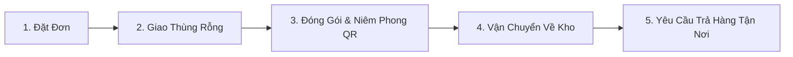

# 📦 Smart Mini Storage (SMS) - Đà Nẵng

> **Lưu trữ thông minh - Vận chuyển an toàn**  
> *Hệ thống dịch vụ lưu trữ mini, giao nhận tận nơi và quản lý kho số hóa dành cho Khách du lịch, Chủ shop online và Hộ gia đình tại Thành phố Đà Nẵng.*

---

## 📑 Mục lục
- [Giới thiệu dự án](#-giới-thiệu-dự-án)
- [Tính năng nổi bật](#-tính-năng-nổi-bật)
- [Công nghệ sử dụng](#-công-nghệ-sử-dụng)
- [Cấu trúc dự án](#-cấu-trúc-dự-án)
- [Bảng giá dịch vụ](#-bảng-giá-dịch-vụ)
- [Hướng dẫn cài đặt & Khởi chạy](#-hướng-dẫn-cài-đặt--khởi-chạy)
  - [1. Backend (FastAPI)](#1-backend-fastapi)
  - [2. Frontend (React Web)](#2-frontend-react-web)
  - [3. Mobile App (Expo / React Native)](#3-mobile-app-expo--react-native)
- [Quy trình vận hành 5 bước](#-quy-trình-vận-hành-5-bước)
- [Liên hệ & Đội ngũ](#-liên-hệ--đội-ngũ)

---

## 🌟 Giới thiệu dự án

**Smart Mini Storage (SMS)** là giải pháp toàn diện kết hợp giữa **nền tảng Web, Ứng dụng Di động (Mobile App) và Hệ thống Quản trị Kho (WMS)** nhằm giải quyết các vấn đề quá tải không gian lưu trữ và vận chuyển đồ đạc tại khu vực Đà Nẵng:
- **Khách du lịch**: Gửi hành lý cồng kềnh linh hoạt theo ngày/tuần khi chưa đến giờ check-in hoặc sau khi check-out, di chuyển tự do.
- **Chủ shop online / Doanh nghiệp nhỏ**: Thuê kho linh động theo lượng hàng thực tế, không yêu cầu hợp đồng dài hạn, giảm áp lực chi phí mặt bằng.
- **Hộ gia đình**: Giải phóng không gian sống, lưu trữ an toàn đồ đạc ít sử dụng (đồ theo mùa, nệm, vali, v.v.).

---

## 🚀 Tính năng nổi bật

### 1. 👤 Khách hàng (Customer Hub & Mobile App)
- **Landing Page hiện đại**: Giới thiệu giải pháp, bảng giá minh bạch, hiệu ứng mượt mà và bảo mật thông tin nội bộ.
- **Đặt đơn linh hoạt**: Chọn kích cỡ thùng (Size S/M/L), mô tả hàng hóa, thời gian thuê (theo ngày/tháng), địa chỉ giao nhận.
- **Tự động tính phí vận chuyển thông minh**: Tính theo khoảng cách thực tế (km) và phụ phí bê vác cầu thang/tầng lầu.
- **Bộ đếm thời gian giữ hàng (Countdown Timer)**: Hiển thị chi tiết thời gian lưu kho còn lại theo thời gian thực (ngày, giờ, phút, giây) kèm cảnh báo quá hạn.
- **Theo dõi lộ trình đơn hàng**: Cập nhật trạng thái từng bước (Chờ xác nhận, Đang lấy hàng, Đã nhập Hub, Đang trả hàng, Đã hoàn tất).
- **Trợ lý ảo AI Chatbot**: Tự động tư vấn kích thước thùng và giải đáp quy trình dịch vụ 24/7.

### 2. 🚚 Đội ngũ Shipper (Shipper App)
- **Quét mã QR Code**: Tiếp nhận thùng rỗng, dán niêm phong seal và quét mã bàn giao nhanh chóng.
- **Nhận chuyến & Điều hướng**: Xem chi tiết lộ trình lấy hàng/giao hàng, liên hệ trực tiếp với khách hàng.
- **Cập nhật trạng thái tức thì**: Đồng bộ trạng thái đơn hàng và thông báo về hệ thống quản lý.

### 3. 🏢 Quản trị viên (Admin & Hub Manager)
- **Quản lý kho WMS (Warehouse Management System)**: Sơ đồ quản lý vị trí kệ kho (Lộ trình tối ưu chữ U), theo dõi tồn kho thùng rỗng và thùng đang chứa đồ.
- **Quản lý đơn hàng & Khách hàng**: Quản lý toàn bộ vòng đời đơn hàng, gia hạn, hủy đơn, xử lý yêu cầu trả hàng.
- **Quản lý phân quyền**: Phân quyền chi tiết cho Admin, Nhân viên kho và Đội ngũ Shipper.

---

## 🛠️ Công nghệ sử dụng

| Phân hệ | Công nghệ & Thư viện |
| :--- | :--- |
| **Backend API** | Python 3.10+, FastAPI, Uvicorn, Motor (Async MongoDB), Pydantic |
| **Database** | MongoDB Atlas / Local MongoDB |
| **Bảo mật & Mã hóa** | PyJWT (Authentication), Bcrypt (Password Hashing) |
| **Tích hợp AI** | LiteLLM, Groq API (AI Chatbot hỗ trợ khách hàng) |
| **Web Frontend** | React 19, React Router v7, TailwindCSS, Radix UI, Framer Motion, Leaflet Maps, Axios |
| **Mobile App** | React Native, Expo SDK 54, NativeWind, React Navigation, Expo Camera/Location |

---

## 📁 Cấu trúc dự án

```text
smart-mini-storage-danang/
├── backend/                  # RESTful API Server (Python / FastAPI)
│   ├── server.py             # Main API entrypoint & controllers
│   ├── chatbot.py            # AI Chatbot service
│   ├── requirements.txt      # Python dependencies
│   └── ...
├── frontend/                 # Web Application (React.js)
│   ├── public/               # Static assets (logo, icons, index.html)
│   ├── src/
│   │   ├── components/       # Reusable UI components & Dialogs
│   │   ├── context/          # Auth Context & State Management
│   │   ├── pages/            # LandingPage, CustomerDashboard, AdminDashboard, ShipperApp...
│   │   └── ...
│   └── package.json
├── mobile/                   # Mobile Application (Expo / React Native)
│   ├── src/
│   │   ├── components/       # Mobile UI components
│   │   ├── navigation/       # Stack & Bottom Tabs navigators
│   │   ├── screens/          # Customer, Shipper & Admin mobile screens
│   │   └── services/         # API & Storage services
│   ├── app.json              # Expo configuration
│   └── package.json
├── image/                    # Brand assets & logos
└── README.md                 # Tài liệu hướng dẫn dự án
```

---

## 💰 Bảng giá dịch vụ

| Loại thùng | Kích thước (Dài x Rộng x Cao) | Dung tích | Giá theo ngày | Giá theo tháng | Sức chứa gợi ý |
| :---: | :---: | :---: | :---: | :---: | :--- |
| **Size S** | 52 x 36.5 x 27.5 cm | ~52.2 L | **4.000 VNĐ** | **120.000 VNĐ** | 3-5 đôi giày, tài liệu, balo laptop / 25-30 áo |
| **Size M** *(Phổ biến)* | 62 x 44.5 x 32 cm | ~88.4 L | **6.000 VNĐ** | **180.000 VNĐ** | Đồ cắm trại, chăn mền, đồ thể thao / 50-60 áo |
| **Size L** | 69.5 x 50 x 36 cm | ~125.1 L | **9.000 VNĐ** | **270.000 VNĐ** | Vali lớn, chăn ga gối nệm, chuyển trọ / 80-100 áo |

---

## ⚙️ Hướng dẫn cài đặt & Khởi chạy

### Yêu cầu tiên quyết
- **Node.js** (>= 18.x) & **Yarn** hoặc **npm**
- **Python** (>= 3.10)
- **MongoDB** (Local hoặc URI MongoDB Atlas)
- **Expo Go** trên điện thoại (để test Mobile App)

---

### 1. Backend (FastAPI)

```bash
# 1. Di chuyển vào thư mục backend
cd backend

# 2. Tạo và kích hoạt môi trường ảo (Virtual Environment)
python -m venv venv
# Trên Windows:
venv\Scripts\activate
# Trên macOS/Linux:
source venv/bin/activate

# 3. Cài đặt các thư viện cần thiết
pip install -r requirements.txt

# 4. Thiết lập file biến môi trường (.env)
# Tạo file .env với các cấu hình như:
# MONGO_URL=mongodb://localhost:27017
# DB_NAME=smart_mini_storage
# JWT_SECRET=your_jwt_secret_key

# 5. Khởi chạy server
uvicorn server:app --reload --port 8000
```
> API Swagger UI xem tại: `http://localhost:8000/docs`

---

### 2. Frontend (React Web)

```bash
# 1. Di chuyển vào thư mục frontend
cd frontend

# 2. Cài đặt packages
yarn install
# hoặc: npm install

# 3. Chạy ứng dụng ở môi trường Development
yarn start
# hoặc: npm start
```
> Truy cập Web tại: `http://localhost:3000`

---

### 3. Mobile App (Expo / React Native)

```bash
# 1. Di chuyển vào thư mục mobile
cd mobile

# 2. Cài đặt dependencies
npm install

# 3. Khởi chạy Expo Dev Server
npx expo start -c
```
> Quét mã QR bằng ứng dụng **Expo Go** (Android/iOS) hoặc nhấn `w` để mở giao diện Web.

---

## 🔄 Quy trình vận hành 5 bước



1. **Đặt đơn**: Khách hàng tạo đơn trên App/Web, chọn kích thước thùng và lịch hẹn lấy hàng.
2. **Giao thùng**: Shipper mang thùng rỗng chuyên dụng đến tận nơi.
3. **Đóng gói & Niêm phong**: Khách hàng tự đóng gói đồ đạc, dán tem QR và seal niêm phong bảo mật.
4. **Lưu kho**: Shipper vận chuyển thùng về trung tâm kho Hub an toàn (Camera giám sát 24/7 & chống ẩm mốc).
5. **Trả hàng**: Khách hàng yêu cầu giao trả qua ứng dụng chỉ với 1 chạm.

---

## 👥 Liên hệ & Đội ngũ

- **Đơn vị phát triển**: Smart Mini Storage Team - Đà Nẵng
- **Slogan**: *Lưu trữ thông minh - Vận chuyển an toàn*
- **Email hỗ trợ**: AnhTTH@smartmini.vn | TriDM@smartmini.vn | DucDC@smartmini.vn
- **Địa bàn phục vụ**: Thành phố Đà Nẵng, Việt Nam

---
*© 2026 Smart Mini Storage. All rights reserved.*
